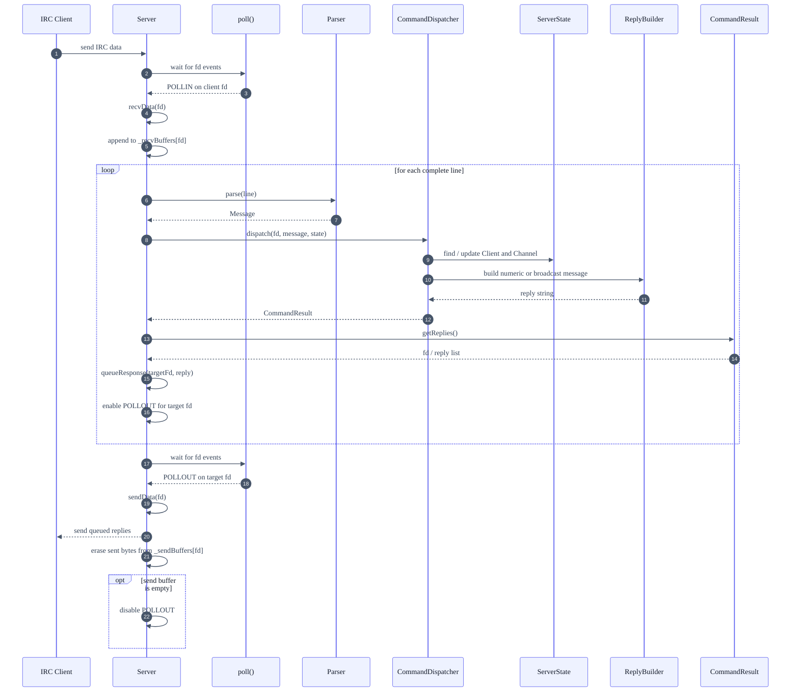
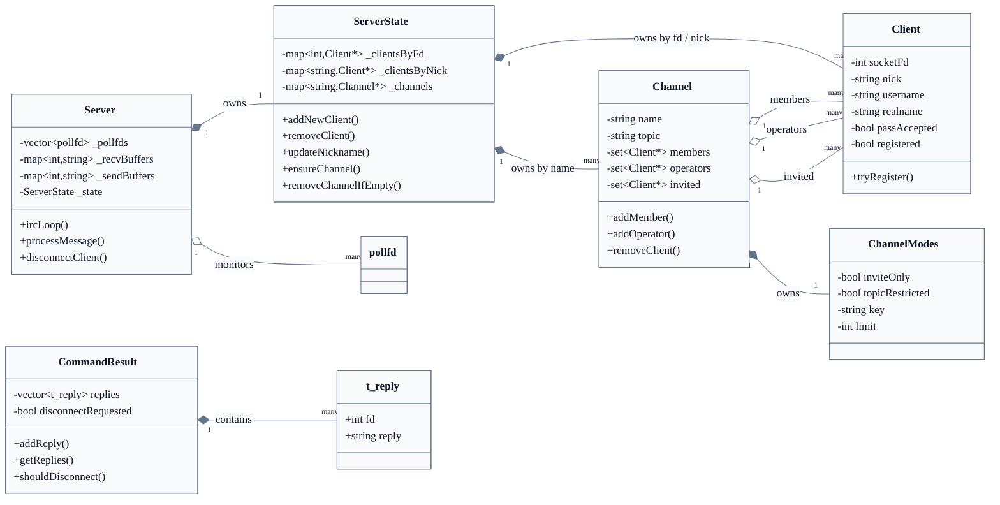

*This project has been created as part of the 42 curriculum by atashiro, sohyamaz.*

# Description
## Architecture Overview

```mermaid
%%{init: {
  "theme": "base",
  "themeVariables": {
    "fontFamily": "Inter, ui-sans-serif, system-ui, sans-serif",
    "primaryColor": "#EEF2FF",
    "primaryTextColor": "#111827",
    "primaryBorderColor": "#6366F1",
    "lineColor": "#64748B",
    "tertiaryColor": "#F8FAFC"
  }
}}%%

flowchart LR
    main["main.cpp<br/>validate args<br/>start server"]

    subgraph network["Network / I/O"]
        server["Server<br/>listen socket<br/>single poll loop<br/>recv / send buffers<br/>disconnect cleanup"]
    end

    subgraph protocol["Protocol / Command"]
        parser["Parser<br/>line to Message"]
        message["Message<br/>command + params"]
        dispatcher["CommandDispatcher<br/>route IRC commands<br/>update server state"]
        reply["ReplyBuilder<br/>numeric replies<br/>broadcast messages"]
        result["CommandResult<br/>fd to reply list<br/>disconnect request"]
    end

    subgraph state["Client / Server State"]
        serverState["ServerState<br/>clients by fd<br/>clients by nick<br/>channels by name"]
        client["Client<br/>fd / nick / username<br/>auth / registered"]
    end

    subgraph channelState["Channel State"]
        channel["Channel<br/>members<br/>operators<br/>invited<br/>topic"]
        modes["ChannelModes<br/>+i / +t / +k / +l"]
    end

    main --> server

    server -->|"complete line"| parser
    parser --> message
    message --> dispatcher

    dispatcher -->|"read / update"| serverState
    dispatcher -->|"build reply text"| reply
    dispatcher --> result
    result -->|"queue to send buffer"| server

    serverState -->|"owns"| client
    serverState -->|"owns"| channel
    channel -->|"references"| client
    channel -->|"owns"| modes

    classDef entry fill:#111827,stroke:#111827,color:#FFFFFF;
    classDef io fill:#ECFEFF,stroke:#0891B2,color:#164E63;
    classDef proto fill:#EEF2FF,stroke:#6366F1,color:#312E81;
    classDef stateClass fill:#F0FDF4,stroke:#22C55E,color:#14532D;
    classDef channelClass fill:#FFF7ED,stroke:#F97316,color:#7C2D12;
## Architecture Overview

```mermaid
%%{init: {
  "theme": "base",
  "themeVariables": {
    "fontFamily": "Inter, ui-sans-serif, system-ui, sans-serif",
    "primaryColor": "#EEF2FF",
    "primaryTextColor": "#111827",
    "primaryBorderColor": "#6366F1",
    "lineColor": "#64748B",
    "tertiaryColor": "#F8FAFC"
  }
}}%%

flowchart LR
    main["main.cpp<br/>validate args<br/>start server"]

    subgraph network["Network / I/O"]
        server["Server<br/>listen socket<br/>single poll loop<br/>recv / send buffers<br/>disconnect cleanup"]
    end

    subgraph protocol["Protocol / Command"]
        parser["Parser<br/>line to Message"]
        message["Message<br/>command + params"]
        dispatcher["CommandDispatcher<br/>route IRC commands<br/>update server state"]
        reply["ReplyBuilder<br/>numeric replies<br/>broadcast messages"]
        result["CommandResult<br/>fd to reply list<br/>disconnect request"]
    end

    subgraph state["Client / Server State"]
        serverState["ServerState<br/>clients by fd<br/>clients by nick<br/>channels by name"]
        client["Client<br/>fd / nick / username<br/>auth / registered"]
    end

    subgraph channelState["Channel State"]
        channel["Channel<br/>members<br/>operators<br/>invited<br/>topic"]
        modes["ChannelModes<br/>+i / +t / +k / +l"]
    end

    main --> server

    server -->|"complete line"| parser
    parser --> message
    message --> dispatcher

    dispatcher -->|"read / update"| serverState
    dispatcher -->|"build reply text"| reply
    dispatcher --> result
    result -->|"queue to send buffer"| server

    serverState -->|"owns"| client
    serverState -->|"owns"| channel
    channel -->|"references"| client
    channel -->|"owns"| modes

    classDef entry fill:#111827,stroke:#111827,color:#FFFFFF;
    classDef io fill:#ECFEFF,stroke:#0891B2,color:#164E63;
    classDef proto fill:#EEF2FF,stroke:#6366F1,color:#312E81;
    classDef stateClass fill:#F0FDF4,stroke:#22C55E,color:#14532D;
    classDef channelClass fill:#FFF7ED,stroke:#F97316,color:#7C2D12;

    class main entry;
    class server io;
    class parser,message,dispatcher,reply,result proto;
    class serverState,client stateClass;
    class channel,modes channelClass;
```

## Request / Response Flow



## State Ownership



    class main entry;
    class server io;
    class parser,message,dispatcher,reply,result proto;
    class serverState,client stateClass;
    class channel,modes channelClass;
```

## Request / Response Flow


## State Ownership


## About IRC

* IRC stands for Internet Relay Chat. It is a text-based chat protocol created in 1988.
* IRC allows users to communicate over the Internet through servers and clients.
* One important characteristic of IRC is that clients may disconnect at any time.
* Based on this idea, the server does not rely on a persistent database to store client data. It only manages the current state of clients, channels, and messages.

## About I/O Multiplexing

* This server uses I/O multiplexing to handle multiple clients at the same time.
* All socket I/O operations are performed in non-blocking mode.
* The server uses a single `poll()` loop to monitor client connections and process read/write events.

# Instructions

**Build and start the server**

```bash
make
./ircserv <portNumber> <serverPassword>
```

**Connect to the server using nc**

```bash
nc -C <hostName> <portNumber>
```

**Connect to the server using irssi**

```bash
irssi
/connect <hostName> <portNumber> <serverPass> <yourNickName>
```

# Resources
# Sites
[RFC 1459](https://datatracker.ietf.org/doc/html/rfc1459)
[簡単なエコーサーバを作成してみた](https://qiita.com/gu-chi/items/1e2ba4e19902f9e39b5e)
[I/O多重化を施したサーバを作成してみた](https://qiita.com/gu-chi/items/243fa63e17617bb9ef77)
[ノンブロッキングなファイルディスクリプタを用いて「I/O多重化」を施したエコーサーバーを作成してみた。](https://qiita.com/gu-chi/items/57d9ba6d6e797dfc8967)
[IRSSI](https://github.com/irssi/irssi)

## Books
- Michel J. Donahoo/Kenneth L. Calvert TCP/IP ソケットプログラミング C言語編 2003

## AI USAGE
We used AI
- To translate README we written in Japanese
- Assist to understand new knowledge or functions from sites and books.
