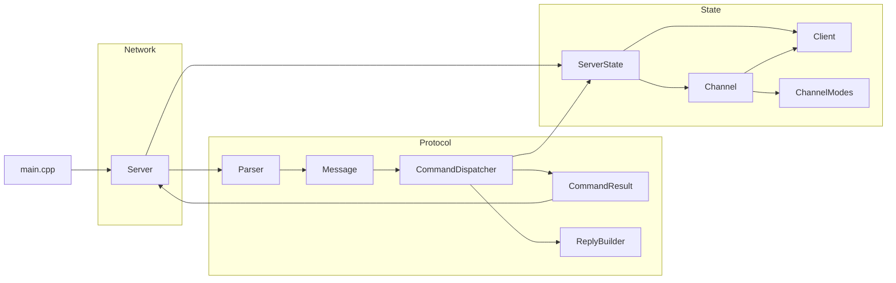
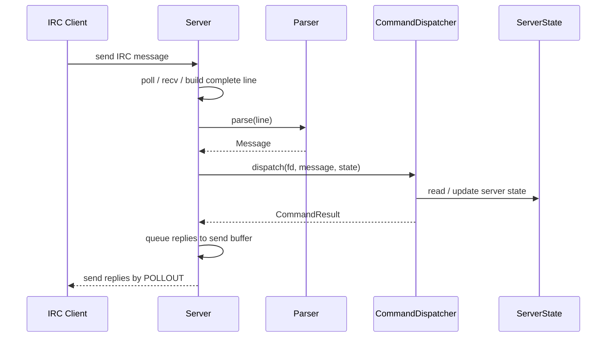
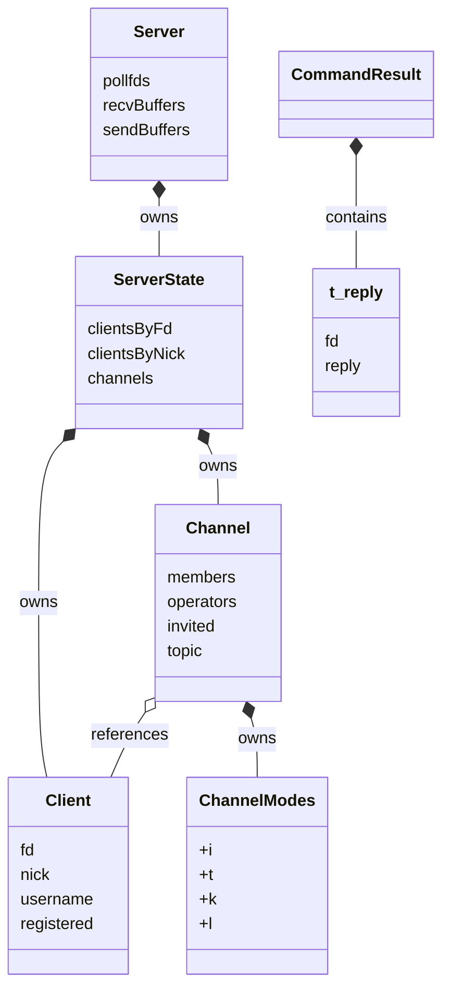

*This project has been created as part of the 42 curriculum by atashiro, sohyamaz.*

# Description
## Architecture



## Request / Response Flow



## State Ownership



## About IRC

* IRC stands for Internet Relay Chat. It is a text-based chat protocol created in 1988.
* IRC allows users to communicate over the Internet through servers and clients.
* One important characteristic of IRC is that clients may disconnect at any time.
* Based on this idea, the server does not rely on a persistent database to store client data. It only manages the current state of clients, channels, and messages.

## About I/O Multiplexing

* This server uses I/O multiplexing to handle multiple clients at the same time.
* All socket I/O operations are performed in non-blocking mode.
* The server uses a single `poll()` loop to monitor client connections and process read/write events.

# Instructions

**Build and start the server**

```bash
make
./ircserv <portNumber> <serverPassword>
```

**Connect to the server using nc**

```bash
nc -C <hostName> <portNumber>
```

**Connect to the server using irssi**

```bash
irssi
/connect <hostName> <portNumber> <serverPass> <yourNickName>
```

# Resources
# Sites
[RFC 1459](https://datatracker.ietf.org/doc/html/rfc1459)

[簡単なエコーサーバを作成してみた](https://qiita.com/gu-chi/items/1e2ba4e19902f9e39b5e)

[I/O多重化を施したサーバを作成してみた](https://qiita.com/gu-chi/items/243fa63e17617bb9ef77)

[ノンブロッキングなファイルディスクリプタを用いて「I/O多重化」を施したエコーサーバーを作成してみた。](https://qiita.com/gu-chi/items/57d9ba6d6e797dfc8967)

[IRSSI](https://github.com/irssi/irssi)

## Books
- Michel J. Donahoo/Kenneth L. Calvert TCP/IP ソケットプログラミング C言語編 2003

## AI USAGE
We used AI
- To translate README we written in Japanese
- To write Mermaid format Architecture figure.
- Assist to understand new knowledge or functions from sites and books.

